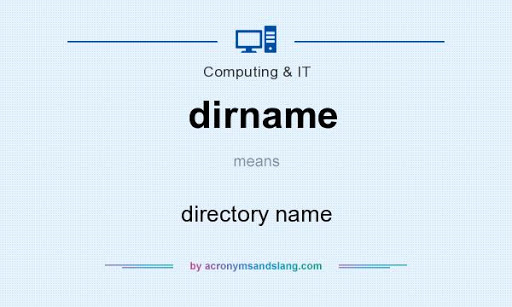

# dirname

dirname — Returns a parent directory's path

***การใช้งาน***

        dirname ( string $path , int $levels = 1 ) : string

***ตัวอย่าง***

        <?php
        echo dirname(".1/.2/.3/.4/.5/etc/passwd/passwd",4) . PHP_EOL;
        echo dirname("/etc/") . PHP_EOL;
        echo dirname(".") . PHP_EOL;
        echo dirname("C:\\") . PHP_EOL;
        echo dirname("/usr/local/lib", 4);
        /?>

***ผลลัพธ์***

        .1/.2/.3/.4
        /
        .
        .
        /`

***ตัวอย่างช่องโหว่***

File Disclosure คือ ช่องโหว่ที่เปิดทางให้ผู้ไม่ประสงค์ดีดึงไฟล์อื่นๆที่อยู่ในเว็บไซต์มารัน หรือ อ่านไฟล์ เช่น ไฟล์ config ,passwd โดยมีสาเหตุมาจากการที่ผู้พัฒนาเว็บไซต์ไม่คำนึงถึงความปลอดภัยในการเขียน ทำให้ผู้ไม่ประสงค์ดี สามารถดาวน์โหลดไฟล์ที่สำคัญที่อยู่บนเครื่องเซิร์ฟเวอร์มาใช้ประโยขน์ในการโจมตีเว็บไซต์ได้

        echo  file_get_contents("files/"  .  $_GET["file"]);

***ทดสอบการเจาะ***

        /index.php?file=../../../../../../../etc/passwd

***วิธีการแก้ไข***

        echo dirname(".1/.2/.3/.4/.5/etc/passwd/passwd",4) ;

- output:
        
        .1/.2/.3/.4

จะเห็นว่ามีการไม่แสดงชื่อไฟล์ เมื่อเอาไปประยุกต์ในในการป้องกันไม่ให้เข้าไปถึงไฟล์ได้ระดับหนึ่ง

***อ้างอิง***

+ http://libdoc.dpu.ac.th/thesis/Nachnaphat.Jai.pdf
+ https://3v4l.org/#live
+ https://www.youtube.com/watch?v=tnd5gJl1V_Q
+ https://www.php.net/dirname